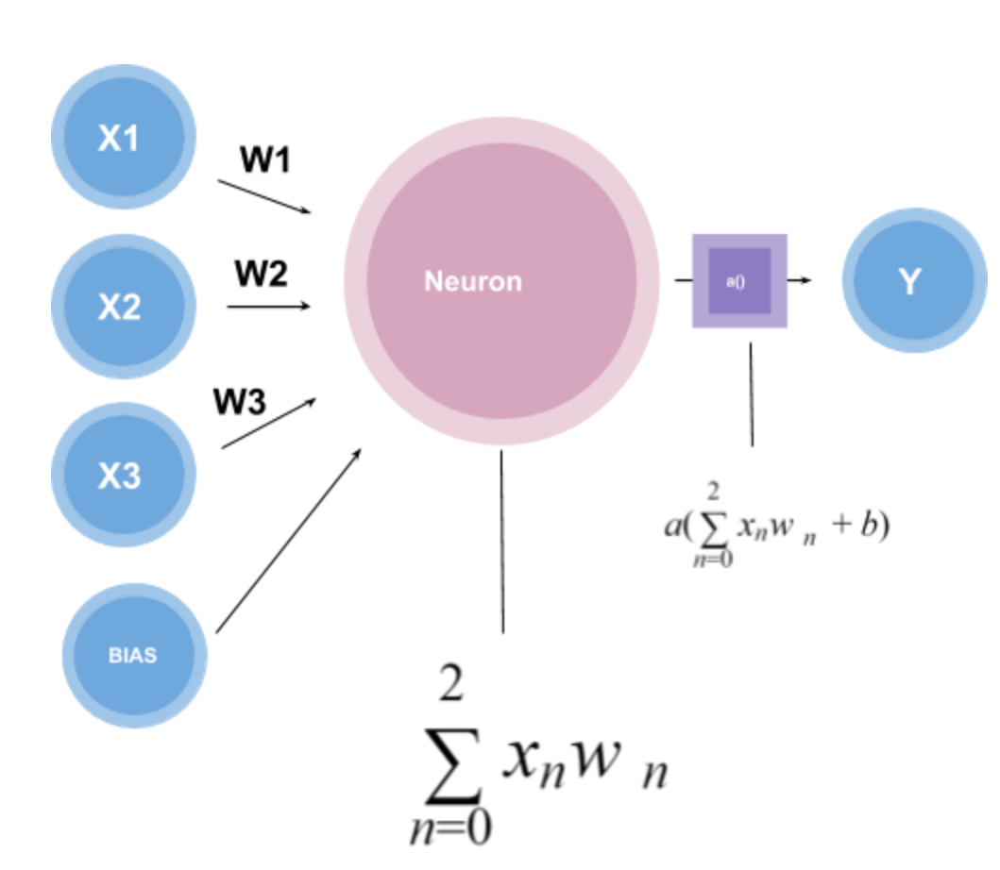

# Day2：神经网络原理（感知机、多层感知机）

当然可以！教练上线！🏋️‍♂️  
今天是你的 **第二天学习计划：神经网络原理（感知机、多层感知机）**，也是深度学习的第一块基石。我们将迈入 “让机器像人脑一样思考” 的世界。

---

## 🎯 今日目标

> 系统理解 **神经网络的基本结构与原理**，从“感知机”入手，可视化前向传播流程，动手构建你人生中第一个神经元模型！

---

## 🧠 一、你要掌握的核心概念

| 概念 | 含义 | 类比 |
|------|------|------|
| 感知机（Perceptron） | 最简单的神经元单元 | 一个会打分的“逻辑门” |
| 多层感知机（MLP） | 多层神经元组合 | 大脑的神经网络 |
| 前向传播 | 输入 → 权重乘积 → 激活输出 | 水流从入口流过每层管道 |
| 激活函数 | 引入非线性，使网络更强 | 类似“开关”或“阈值门” |
| 权重 / 偏置 | 控制每条连接的强度 | 你大脑中“记忆的强弱” |

---

## 🧭 二、结构图理解

### 🌱 单个神经元（感知机）结构图：

```
 输入1   输入2   输入3
   │       │       │
   ▼       ▼       ▼
 [x1] + [x2] + [x3] → Σ → 激活函数（如 ReLU） → 输出 y
         ↑
     权重 w1,w2,w3，偏置 b
```

### 🌿 多层感知机（MLP）结构图（三层）：

```
输入层 → 隐藏层 → 输出层
[3个输入] → [4个隐藏神经元] → [1个输出]
```

---

## 📚 三、推荐学习资料

### 🎥 视频推荐（任选其一）：

1. [3Blue1Brown 【官方双语】深度学习之神经网络的结构 Part 1 ver 2.0】](https://www.bilibili.com/video/BV1bx411M7Zx/?share_source=copy_web&vd_source=a41006252ba67f12785a8f42077b1293)（极强推荐 ✅）  
2. [吴恩达：神经网络基础](https://www.bilibili.com/video/BV1JE411g7XF?p=5)

### 📖 图文教程：

- [The Perceptron Explained](https://towardsdatascience.com/perceptron-learning-algorithm-d5db0deab975)
  

  Perceptron（感知器）是神经网络的一个极简模型，其用于二元分类器的监督学习。

- [PyTorch 教程：构建一个简单神经网络](https://pytorch.org/tutorials/beginner/blitz/neural_networks_tutorial.html)

神经网络的典型训练过程如下：

1.定义具有一些可学习参数的神经网络（或 权重）

2.迭代输入数据集

3.通过网络处理输入

4.计算损失（输出距离正确结果还有多远）

5.将梯度传播回网络的参数

6.更新网络的权重，通常使用简单的更新规则：weight = weight - learning_rate * gradient
---

## 👨‍💻 四、实战任务：构建第一个感知机模型

### ✅ 环境准备（任选其一）：

- 推荐：使用 [Google Colab](https://colab.research.google.com/)（免费、免安装）  
- 或者本地安装：Python + `torch` + `numpy` + `matplotlib`

---

### ✅ 简单感知机（手工实现）示例代码：

```python
import numpy as np

# 激活函数 & 感知机模型
def step_function(x):
    return 1 if x > 0 else 0

def perceptron(x, w, b):
    total = np.dot(x, w) + b
    return step_function(total)

# 示例输入
x = np.array([1.0, 1.0])
w = np.array([0.5, 0.5])
b = -0.7

output = perceptron(x, w, b)
print("输出结果:", output)
```

> 🚀 尝试把输入改成 `[0, 1]`、`[1, 0]`，感知机能否区分？

---

## 🔍 五、激活函数小实验（可视化）

```python
import matplotlib.pyplot as plt
import numpy as np

x = np.linspace(-10, 10, 100)

def sigmoid(x): return 1 / (1 + np.exp(-x))
def relu(x): return np.maximum(0, x)

plt.plot(x, sigmoid(x), label="Sigmoid")
plt.plot(x, relu(x), label="ReLU")
plt.legend()
plt.title("激活函数对比")
plt.grid(True)
plt.show()
```

> 💡 你会看到 Sigmoid 平滑，ReLU 更干脆。后者更常用于现代网络。

---

## ✅ 六、今日任务清单

| 任务 | 状态 |
|------|------|
| 看完视频或图文教程 ✅ | [ ] |
| 手工画一张感知机结构图 ✅ | [ ] |
| 编码实现一个感知机模型（Python） ✅ | [ ] |
| 尝试不同输入，观察输出变化 ✅ | [ ] |
| 可视化激活函数（Sigmoid vs ReLU） ✅ | [ ] |
| 写一段总结（什么是感知机？前向传播的流程？） ✅ | [ ] |
感知器是最小规模的神经网络，它由输入、权重、偏置、激活函数构成，目的是完成二分类问题。
前向传播的流程是in-w-b-f(x)-out

---

## 🧪 七、思考题（可写在 Notion）

1. 为什么感知机必须加激活函数？
2. 多层感知机解决了单层不能做什么的问题？
3. 如果没有偏置（bias），会对模型性能造成什么影响？

---

## 📝 Bonus 任务（可选）

- 🧠 自己实现一个“与门/或门”模型（逻辑感知机）
- 🔁 尝试用 `torch.nn.Linear` 重写感知机
- 📘 阅读 Perceptron 的历史（1958 年 Frank Rosenblatt）

---

## ✅ 明日预告

> 📍**Day 3：激活函数、损失函数与优化器原理**  
你将学会神经网络如何“知道自己做错了”，并用数学方法“纠正自己”。


