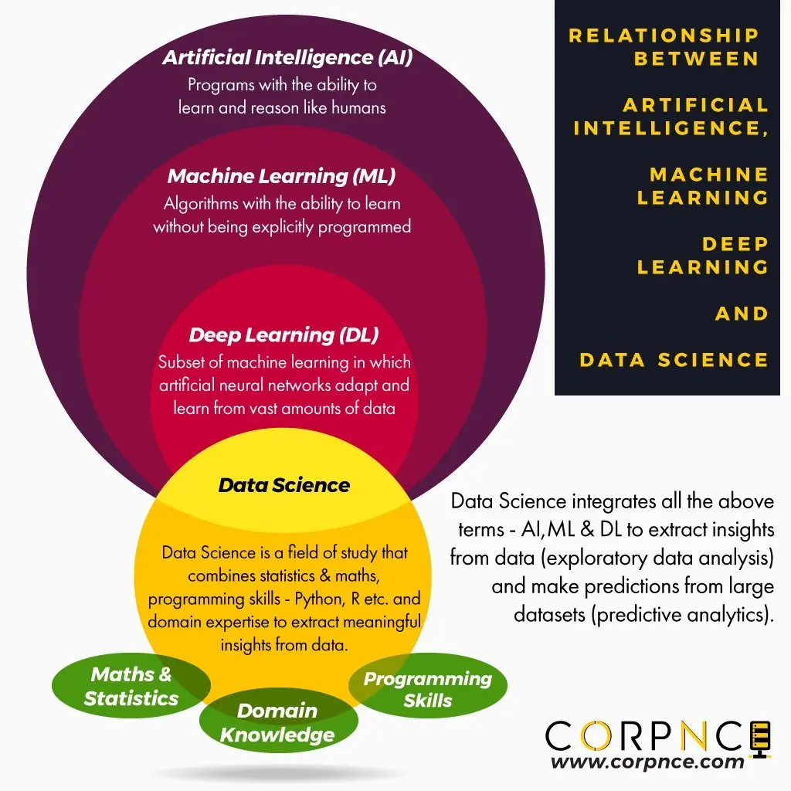

# AI之五花八门的概念

## AI, ML, DL & Data Science 之间的关系

### Artificial Intelligence(AI) 人工智能 
有能像人类一样学习和推理能力的程序
### Machine Learning(ML) 机器学习
无需明确编程也能够学习的算法
### Deep Learning(DL) 深度学习
机器学习的子集，其特点是人工神经网络从海量的数据中适应和学习
### Data science 数据科学

## AI Agent

Agents, are systems where LLMs dynamically direct their own processes and tool usage, maintaining control over how they accomplish tasks.（From:[anthropic官网——构建高效agents](https://www.anthropic.com/engineering/building-effective-agents)）

Agents是LLM动态指导自己的流程和工具使用，保持对他们完成任务方式的控制的系统。

通俗来说，Agent就是模型基于环境反馈使用tool的一个系统。

# AI相关平台
## [Hugging Face](https://huggingface.co/)
The Hugging Face Hub is a platform with over 900k models, 200k datasets, and 300k demos in which people can easily collaborate in their ML workflows. The Hub works as a central place where anyone can share, explore, discover, and experiment with open-source Machine Learning.

是目前最大的AI社区平台，汇聚最全的大模型、数据集和demo，以普及和推进面向所有人的ML.
