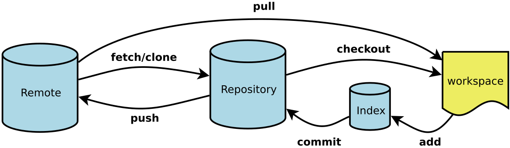

# Git常用命令



## Git的原理
存储项目文件随时间变化的快照

## git init 初始化
开始跟踪当前文件夹的diff（变化）

## git add 添加要提交的东西
```
git add .
git add README.md
```

## git commit 提交
给你的代码照一个快照，以便可以穿越回任何一个快照当时的状态
```
git commit -m "first commit"
```
###  HEAD 最近的一次提交

## git push 推送

## git branch 分支
创建代码宇宙的一个新的支线
```
git branch [newBranch]
```

## git merge 合并
```
git merge newBranch
```
如果发生conflict（冲突），则需要解决