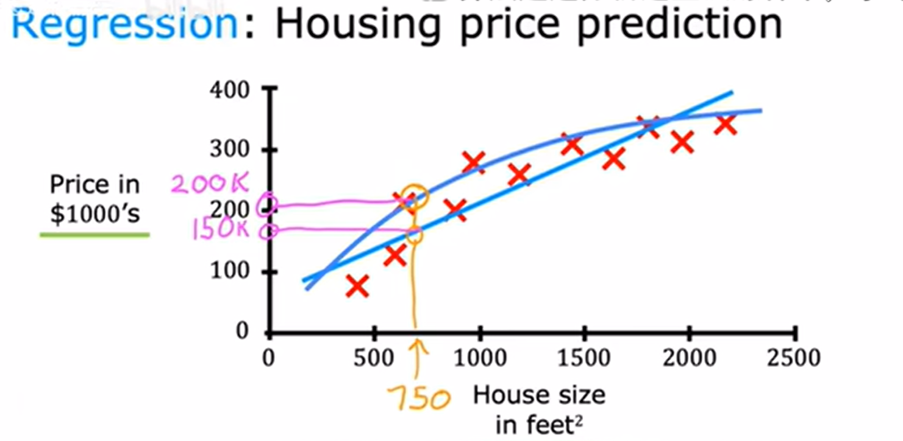

# 吴恩达机器学习课程CS229（2018年新版课程）
以人类拥有的数据量以及拥有的技术手段，很长时间才会耗尽机会。

## 1.1 机器学习（欢迎） 
**20250702**

无需特定编程也能让机器学习
The Science of getting computers to learn without being explicitly programmed.

## 1.2 应用领域
**20250702**

在人类不知道如何具体编程去解决问题的领域使用，让计算机自己学习如何去解决具体问题。eg:自动驾驶
### AGI 通用人工智能/强AI
被夸大，近期不太可能实现

## 2.1 什么是机器学习
**20250702**
### 定义
Field of study that gives computer the ability to learn without being explicitly programmed.
——Arthur Samul（1959）
### 三种主要类型
- Supervised learning
- Unsupervised learning
- Reinforcement learning
### 我们要学习什么？
- 认知各种工具适合的场景
- 认知如何高效构建机器学习系统

## 2.2监督学习 part1——介绍&回归
**20250702**
使用x(input)->y(output)进行训练

Learns from being given "**right answers**"

eg：判断垃圾邮件、语音识别、翻译、广告个性化、通过图像和雷达判断其他车辆位置、识别瑕疵产品、房价预测

举例：回归预测
